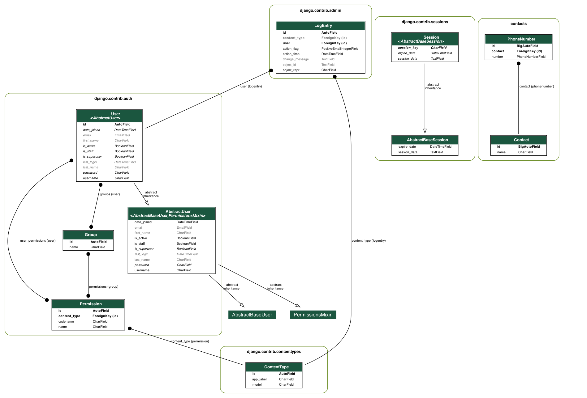

# Phonebook App

This is a simple Phone Book Application to store contacts.

## Table of Contents

- [Installation](#installation)
- [Usage](#usage)
- [Database Schema Diagram](#database-schema-diagram)

## Installation

1. Clone the repository:

   ```bash
   git clone https://github.com/ZiyadMoneep/phonebook.git
2. Run:

- Build the Docker containers:
   ```bash
     docker-compose build

- Start the Docker containers:
   ```bash
     docker-compose up
     docker-compose exec web python manage.py migrate

3. Database Schema Diagram:
   
